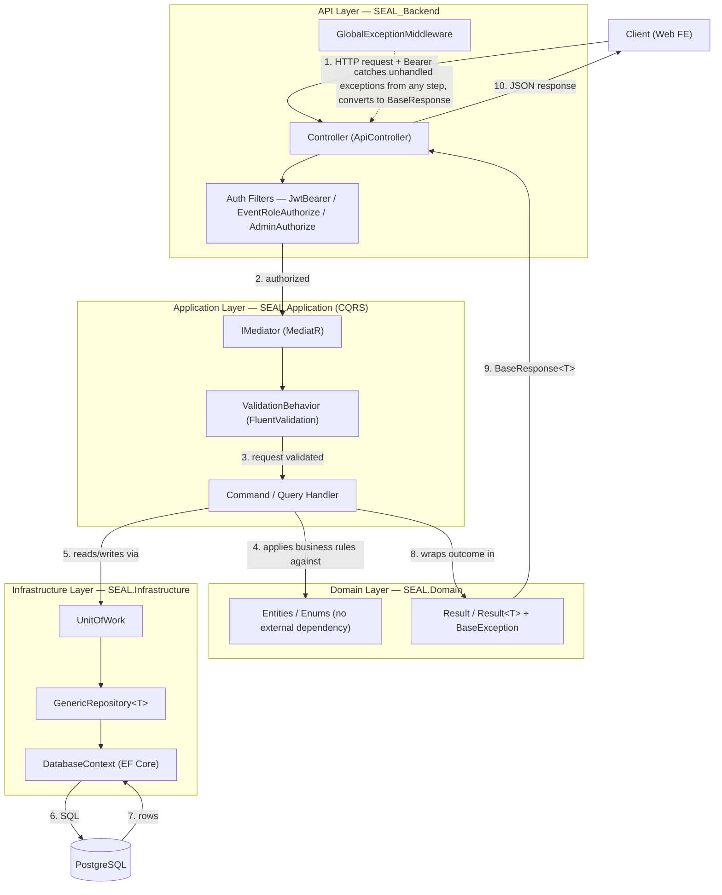
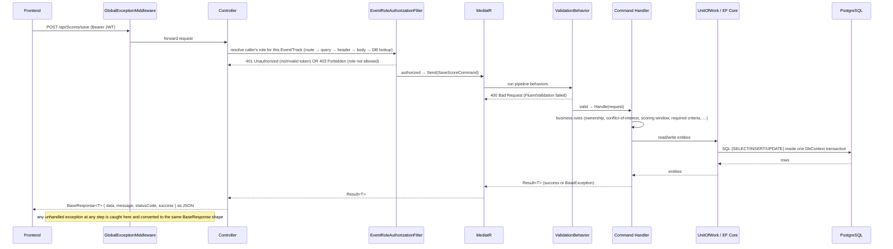
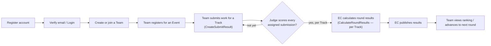

# SEAL Backend

## Table of Contents

- [Overview](#overview)
- [Tech Stack](#tech-stack)
- [Architecture (Clean Architecture + CQRS)](#architecture-clean-architecture--cqrs)
- [Dependency Injection Pattern](#dependency-injection-pattern)
- [Project Structure](#project-structure)
- [System Operation Diagram](#system-operation-diagram)
- [Implemented vs Planned Flows](#implemented-vs-planned-flows)
- [User Flow (Student / Team)](#user-flow-student--team)
- [Setup & Run](#setup--run)

---

## Overview

SEAL Backend is a REST API built with **ASP.NET Core (.NET 10)**, powering the SEAL competition/event judging platform. It serves the frontend (web) and exposes endpoints for:

- **Auth & Users** *(planned — not yet ported into this repo)*: registration, login, JWT refresh, role invitations.
- **Events & Rounds** *(planned)*: events, rounds, tracks, scoring templates & criteria.
- **Teams** *(planned)*: team creation, member invitations, event registration.
- **Submissions & Scoring** *(implemented)*: teams submit their work per track, judges score against a weighted criteria template, mentors track team progress.
- **Results & Prizes** *(partially implemented — calculation only)*: per-track ranking, advancement rules, publishing, prize assignment.

The domain layer (all 19 entities/enums) and the infrastructure layer (EF Core, repositories, JWT, email, cloud storage) are already scaffolded for every flow above — each teammate builds their own flow's `Features/` slice and `Controllers/` on top of this shared foundation without touching each other's code.

## Tech Stack

| Layer | Technology |
|---|---|
| Runtime | .NET 10 / ASP.NET Core Web API |
| Database | PostgreSQL (via Npgsql) |
| ORM | Entity Framework Core 10 (Code-First, migrations) |
| CQRS / Mediator | MediatR |
| Validation | FluentValidation (as a MediatR pipeline behavior) |
| Auth | JWT Bearer (`Microsoft.AspNetCore.Authentication.JwtBearer`) |
| API docs | Swagger / OpenAPI (`Swashbuckle`), with a Bearer auth scheme wired in |
| Containerization | Docker + docker-compose (env-var driven, no hardcoded secrets) |
| Deployment | Render (API + managed Postgres via `render.yaml`) |
| CI | GitHub Actions (`dotnet restore/build/test` against `SEAL_Backend.slnx`) |

## Architecture (Clean Architecture + CQRS)

The solution follows **Clean Architecture**: dependencies only point inward, from API → Application → Domain, with Infrastructure implementing interfaces defined in Application/Domain. Instead of MVVM's View/ViewModel/Repository split, the equivalent request pipeline here is **Controller → MediatR (CQRS) → Handler → UnitOfWork/Repository → EF Core → PostgreSQL**, with every result wrapped in a `Result<T>` / `BaseResponse<T>` envelope instead of a `ViewState` enum.



**Layer responsibilities**

- **`SEAL.Domain`** — entities (`User`, `Event`, `Round`, `Track`, `Team`, `SubmitResult`, `Score`, `FinalResult`, …), enums, the `Result`/`Result<T>` pattern, `BaseException` hierarchy, `BaseResponse<T>`. Zero dependency on any other layer or external package (besides the BCL).
- **`SEAL.Application`** — one folder per feature under `Features/<Feature>/{Commands,Queries}/<UseCase>/`, each use case = 1 MediatR `Command`/`Query` + its `Handler` + (optionally) a `Validator` + response `Models/`. Also owns the interfaces Infrastructure implements (`IUnitOfWork`, `IEmailService`, `ITokenService`, …).
- **`SEAL.Infrastructure`** — `DatabaseContext` (EF Core), `IEntityTypeConfiguration<T>` per entity, `GenericRepository`/`UnitOfWork`, `TokenService` (JWT), `EmailService`, `CloudflyStorageService`, `CurrentUserService` (reads the JWT claims of the caller).
- **`SEAL_Backend`** — thin HTTP layer: Controllers call `IMediator.Send(...)` and return the `Result<T>` via `OkResponse(result)`; no business logic lives here. Custom filters (`EventRoleAuthorizeAttribute`, `AdminAuthorizeAttribute`, `AdminOrCoordinatorAuthorizeAttribute`) enforce role checks before the request reaches MediatR.

## Dependency Injection Pattern

Unlike a Flutter app (which needs a third-party service locator such as `GetIt`), ASP.NET Core has a **built-in DI container** (`IServiceCollection`), configured once in `Program.cs`. There is no separate "locator" file — registration happens right where the app is built.

| Lifetime | Registration | Meaning | Used for in this project |
|---|---|---|---|
| **Scoped** | `AddScoped<TInterface, TImpl>()` | One instance per HTTP request, shared across everything resolved during that request | `IUnitOfWork`, `ITokenService`, `IEventRoleChecker`, `ICurrentUserService`, `IEmailService`, `IEventMetadataResolver`, `DatabaseContext` (added implicitly by `AddDbContext`) |
| **Singleton** | `AddSingleton<TInterface, TImpl>()` | One instance for the whole application lifetime | `ICloudStorageService` (`CloudflyStorageService`) |
| **Transient** | `AddTransient(typeof(IPipelineBehavior<,>), typeof(ValidationBehavior<,>))` | A new instance every time it is requested | MediatR pipeline behaviors (`ValidationBehavior<,>`) — must be stateless per-request |

`IUnitOfWork` being **Scoped** is the key rule to respect when adding a new feature: it shares the same `DatabaseContext` (and therefore the same EF Core change-tracker/transaction) with everything else resolved in that request — never register a new data-access service as Singleton, or it will hold a stale/disposed `DbContext` across requests.

MediatR handlers and FluentValidation validators are **not registered one-by-one** — `builder.Services.AddMediatR(cfg => cfg.RegisterServicesFromAssembly(typeof(IUnitOfWork).Assembly))` and `AddValidatorsFromAssembly(...)` scan the whole `SEAL.Application` assembly at startup, so a new `Features/<X>/Commands/<Y>/` slice is picked up automatically — no change needed in `Program.cs` when a teammate adds their own flow.

## Project Structure

```
backend/
├── SEAL_Backend.slnx                 # solution file (root)
├── Dockerfile / docker-compose.yml   # env-var driven, no hardcoded secrets
├── render.yaml                       # Render deployment blueprint (API + Postgres)
├── docs/
│   ├── CLEAN_ARCHITECTURE_GUIDELINES.md
│   ├── DEVELOPMENT_WORKFLOW.md       # how to add a new feature slice
│   └── BUSINESS_LOGIC.md
│
├── SEAL.Domain/                      # innermost layer — no dependencies
│   ├── Entity/                       # 19 entities (User, Event, Round, Track, Team, SubmitResult, Score, ScoreDetail,
│   │   └── Enums/                    #   FinalResult, Prize, Appeal, Criteria, Template, TemplateCriteria, EventRole, …)
│   ├── Base/                         # Result / Result<T>, BaseException, BaseResponse<T>, StatusCodeHelper
│   ├── EventBus/  Store/  Ultis/
│
├── SEAL.Application/                 # use cases — depends only on Domain
│   ├── Features/
│   │   ├── SubmitResults/Commands|Queries/<UseCase>/
│   │   │     ├── <UseCase>Command.cs | Query.cs   # MediatR IRequest
│   │   │     ├── <UseCase>Handler.cs               # IRequestHandler — business logic lives here
│   │   │     ├── <UseCase>Validator.cs             # FluentValidation (optional)
│   │   │     └── Models/                           # request/response DTOs for this use case
│   │   ├── Scores/Commands|Queries/…
│   │   ├── FinalResults/Commands/CalculateRoundResults/…
│   │   └── Teams/Queries/GetMySubmissions/…
│   ├── Interfaces/                   # IUnitOfWork, IEmailService, ITokenService, ICurrentUserService, …
│   ├── Services/UnitOfWork/
│   └── Commons/                      # ValidationBehavior (MediatR pipeline), PagedResult, …
│
├── SEAL.Infrastructure/              # implements Application's interfaces — depends on Domain + Application
│   ├── Persistence/
│   │   ├── DatabaseContext.cs
│   │   ├── Configurations/           # IEntityTypeConfiguration<T>, one file per entity
│   │   ├── Extensions/  Seeding/
│   ├── Repositories/  UnitOfWork/    # GenericRepository<T>, UnitOfWork
│   ├── Services/                     # TokenService, EmailService, CloudflyStorageService, CurrentUserService
│   └── Migrations/                   # EF Core migrations (gitignored locally per-dev, regenerate as needed)
│
├── SEAL_Backend/                     # composition root / HTTP layer
│   ├── Program.cs                    # DI registrations, JWT config, Swagger, middleware pipeline
│   ├── Controllers/                  # SubmitResultsController, ScoresController, FinalResultsController, StorageController
│   ├── Filters/                      # EventRoleAuthorize, AdminAuthorize, AdminOrCoordinatorAuthorize
│   ├── Middlewares/                  # GlobalExceptionMiddleware
│   └── Helpers/                      # CustomControllerBase (OkResponse helper), Authentication (Token.GetUserIdFromHttpContext)
│
└── SEAL.Tests.Application/           # unit tests for Application-layer handlers (xUnit)
```

## System Operation Diagram

How a single authenticated write request (e.g. a judge saving a score) flows through every layer end-to-end:



## Implemented vs Planned Flows

This repo is a **shared foundation**: the Domain/Infrastructure layers already model every flow, but each flow's `Features/` + `Controllers/` is built by whoever owns that flow.

| Flow | Status | Controllers |
|---|---|---|
| Auth & Users | ⏳ Planned | — |
| Events, Rounds & Tracks | ⏳ Planned | — |
| Teams | ⏳ Planned | — |
| **Submissions & Scoring** | ✅ Implemented | `SubmitResultsController`, `ScoresController`, `StorageController` |
| **Results (calculate)** | ✅ Implemented | `FinalResultsController` (`CalculateRoundResults` only — Publish/Prize actions belong to the Results & Prizes flow and are not yet built) |
| Results & Prizes (publish, assign prize) | ⏳ Planned | — |

## User Flow (Student / Team)

The intended end-to-end flow once every flow above is implemented (submissions & scoring are live today; the rest is the target shape other teammates are building):



Rules already enforced today (see `SEAL.Application/Features/SubmitResults` and `.../Scores`):

- A team may only submit **once per Track** (not once per Round — a Round can have several Tracks running in parallel).
- Submissions are only accepted inside the Track's (or, as a fallback, the Round's) submission window, and only if the team advanced from the previous round.
- A judge cannot score a team they are a member of (conflict-of-interest check), and can only score after the submission window has closed.
- Round results are calculated **per Track**: a Track missing judge scores is skipped (returned in `SkippedTracks`) without blocking Tracks that are already fully scored.

## Setup & Run

**Prerequisites**: .NET 10 SDK, PostgreSQL (local or via Docker), and the connection string supplied as `Database__*` environment variables (see `.env.example`) — never hardcoded in `appsettings.json`.

```bash
# restore & build
dotnet restore SEAL_Backend.slnx
dotnet build SEAL_Backend.slnx

# apply EF Core migrations (creates/updates the schema)
dotnet ef database update --project SEAL.Infrastructure --startup-project SEAL_Backend

# run the API (Swagger UI at /swagger, health check at /health)
dotnet run --project SEAL_Backend
```

Or with Docker Compose (spins up the API + a local Postgres container):

```bash
cp .env.example .env   # fill in DB_PASSWORD and any secrets
docker compose up --build
```

Run the test suite:

```bash
dotnet test SEAL_Backend.slnx
```
